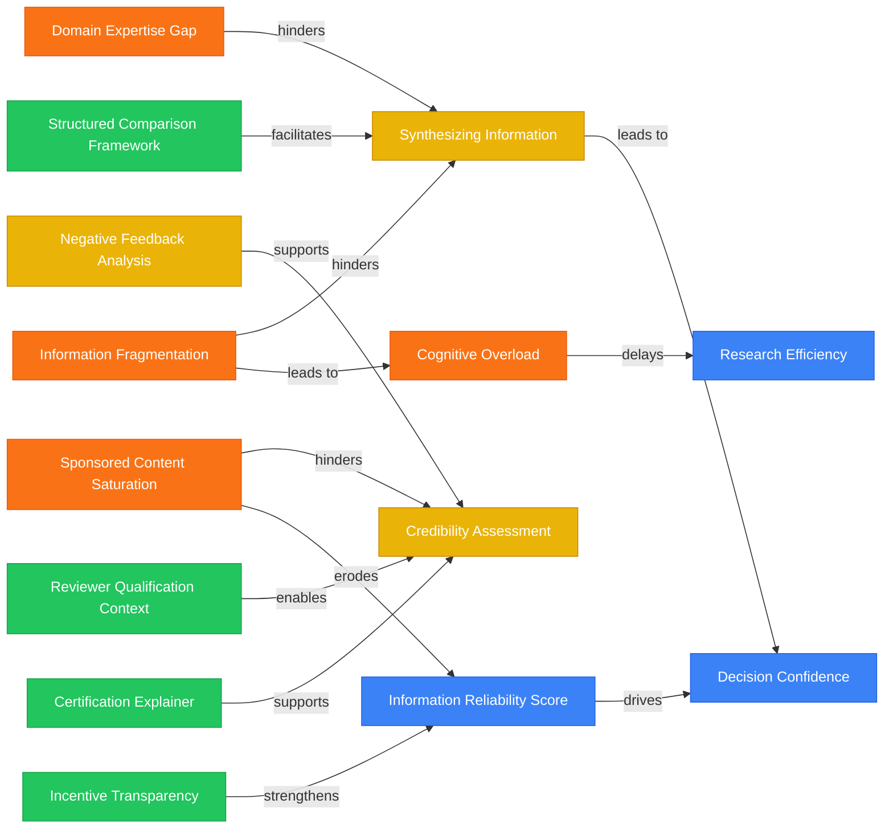

# Research Synth

## Purpose

`research-synth` turns qualitative research inputs into product decision assets.

It is not a generic summarizer. It should help the user move from raw research material to:

- evidence-backed themes
- user pains, jobs, behaviors, and tensions
- product opportunities
- MVP and concept recommendations
- adoption and trust risks
- next research questions
- optional knowledge graph / mechanism map

Core framing:

> Interview / survey / transcript input → product insight synthesis → actionable research artifacts.

---

## When to use

Use this skill when the user asks to:

- analyze user interviews or customer transcripts
- synthesize multiple Q&A files
- analyze synthetic user interviews
- process survey open-ended responses
- turn qualitative research into product insights
- identify themes, contradictions, tensions, and high-signal observations
- evaluate a product concept from interview feedback
- produce a research report, evidence matrix, opportunity backlog, or next research plan
- build a research knowledge graph from interview findings
- adapt qualitative research synthesis to industries such as automotive, FMCG, healthcare, education, B2B SaaS, or consumer products

Example requests:

```text
/research-synth @User1.md @User2.md
```

```text
Analyze these customer interviews and generate product opportunities.
```

```text
Synthesize these synthetic user Q&A files into a research report and KG.
```

```text
Use these interviews to evaluate whether this product concept is viable.
```

---

## Do not use

Do not use this skill when:

- the user only wants a short summary of a single document
- the task is purely quantitative statistical analysis
- the user asks for academic literature review rather than primary research synthesis
- the input has no user/customer/research content
- the user asks for copywriting, marketing slogans, or creative ideation without research material
- the user wants code review or software architecture analysis

If the task is ambiguous, ask whether the user wants a short summary or a product research synthesis.

---

## Accepted inputs

Inputs may include:

- Markdown interview transcripts
- Q&A files
- synthetic user conversations
- user research notes
- survey open-ended responses
- customer support logs
- sales call notes
- field research notes
- social listening excerpts
- product concept feedback
- usability test transcripts

Optional context may include:

- industry
- category
- target user
- research stage
- product concept
- tested prototype
- business model
- competitor set
- desired output artifacts
- target output folder

If context is missing but needed for interpretation, infer cautiously and state assumptions. Ask clarifying questions only when the missing context would materially change the analysis.

---

## Reference case

Use the following case as the canonical reference for how this skill should behave.

### Reference input files

- [[Projects/项目_Kenvue 科赴 消费者触点/0607 Synthetic User1 Q&A.md]]
- [[Projects/项目_Kenvue 科赴 消费者触点/0607 Synthetic User2 Q&A.md]]

### Reference output files

- [[Projects/项目_Kenvue 科赴 消费者触点/0607 Synthetic Users Report.md]]
- [[Projects/项目_Kenvue 科赴 消费者触点/0607 Synthetic Users Report KG.md]]

### Reference design note

- [[Product/AI Survey/AI访谈洞察综合Skill设计.md]]

### What the reference case demonstrates

The reference case converts two synthetic user Q&A files into:

1. a structured research synthesis report
2. a knowledge graph of pains, jobs, enablers, factors, and metrics
3. a product interpretation of the opportunity
4. a cautious viability assessment
5. a set of MVP and next research recommendations

The reference case should guide the skill's output style, especially:

- preserving methodological caveats
- distinguishing evidence from inference
- identifying concept ambiguity
- translating user quotes into product implications
- generating a mechanism map rather than a generic mindmap

---

## Reference case: input summary

### User 1: Li "Suki" Ruoxi

Profile:

- 27-year-old data strategy analyst
- helped her sister research maternal and infant products
- analytical, comparison-oriented, but unfamiliar with the product category

Key evidence from the interview:

- Information was “scattered and inconsistent.”
- She could not distinguish genuine user experience from sponsored content.
- She wanted side-by-side comparison across price, safety certifications, ingredient sourcing, and sentiment.
- She lacked a domain baseline and did not know which certifications or signals mattered.
- She trusted specificity of negative feedback more than vague praise.
- She could not evaluate the proposed solution because what she saw sounded like “a research question, not a solution concept.”

Product interpretation:

- The user does not need more content; she needs structured decision support.
- Credibility filtering must be transparent, not black-boxed.
- Negative feedback should be treated as decision evidence, not merely brand risk.
- Concept clarity is a research requirement: users cannot evaluate vague prompts as solutions.

### User 2: Zhang "Leon" Junhao

Profile:

- 31-year-old senior tactical data analyst
- quantitative-first and risk-averse
- evaluated a baby monitor as a high-risk gift purchase

Key evidence from the interview:

- The hardest issue was “the lack of a reliable evaluation framework.”
- Review data gives volume and sentiment but not reviewer context.
- Certification labels “look like signal but I can't decode it.”
- Current reviews are “wide but not deep” and lack long-term usage data.
- Choosing a known brand was “risk aversion dressed up to look like analysis.”
- He would accept a subscription-like model but reject affiliate commissions, paid placement, hidden sponsorship, or user data monetization.
- Even with a useful tool, he would audit the platform itself.

Product interpretation:

- Reviewer qualification context is a core feature, not metadata.
- Certification interpretation is a high-value white space.
- Longitudinal evidence matters for high-stakes products.
- Business model transparency is part of product trust.
- The product should be an inspectable evidence layer, not a black-box recommendation engine.

---

## Reference case: output pattern

The reference report organizes the findings into these sections:

1. Executive Summary
2. Overall viability signal
3. What users are trying to solve
4. Early assessment of solution direction
5. Strengths users responded to
6. Major risks and weaknesses
7. Comparison with existing behavior and alternatives
8. Priority recommendations
9. Major themes identified in interviews
10. Unexpected findings and surprises
11. Deep-dive into high engagement areas
12. Contradictions and tensions in perception
13. Exploratory insights and implications
14. Recommendations for further research and action
15. Bottom-line recommendation

When generating a full report, follow this general structure unless the user requests a different format.

---

## Core workflow

Follow this workflow for every research synthesis task.

### Step 1: Read and normalize inputs

Read all explicitly referenced files.

For each input, identify:

- participant name or ID
- participant profile
- role / segment / persona
- interview context
- questions
- answers
- notable quotes
- product concept being tested, if any
- methodological caveats

If files are large, process them in chunks and maintain participant-level notes.

### Step 2: Per-participant coding

Code each participant separately before cross-user synthesis.

Extract:

- pains
- jobs-to-be-done
- behaviors
- triggers
- constraints
- desired outcomes
- existing alternatives
- workarounds
- trust concerns
- credibility signals
- willingness to pay
- business model concerns
- desired features
- emotional intensity
- contradictions
- high-signal quotes
- caveats or invalid responses

Use this coding frame by default:

```text
Pain
Job
Behavior
Trigger
Constraint
Factor
Enabler
Risk
Metric
Feature
BusinessModel
Assumption
Quote
Caveat
```

### Step 3: Cross-participant synthesis

Cluster codes across participants.

Identify:

- repeated themes
- convergent evidence
- divergent opinions
- unique but high-signal observations
- contradictions and tensions
- surprising findings
- high-engagement areas
- weak or ambiguous signals
- methodological limitations

Do not simply average user opinions. Preserve high-signal minority findings when they reveal product risk or opportunity.

### Step 4: Evidence-backed interpretation

For each major theme, separate:

- Evidence: what users explicitly said or did
- Interpretation: what the evidence likely means
- Product implication: what the product team should consider
- Hypothesis: what should be tested next
- Recommendation: what action to take

Never present inference as if it were direct evidence.

### Step 5: Product translation

Translate user language into product design language.

Example:

```text
User evidence:
“I don't know which certification matters.”

Product interpretation:
The user lacks a domain-specific evaluation framework.

Feature opportunity:
Certification explainer with plain-language summary, scope, limitations, source, comparison to alternatives, and last-reviewed date.
```

For every key theme, generate at least one product implication or design opportunity.

### Step 6: Viability assessment

If the input involves a concept or solution, assess:

- problem severity
- solution relevance
- concept clarity
- adoption barriers
- trust barriers
- usability risks
- willingness to pay
- business model fit
- differentiation from current alternatives
- go / no-go / refine recommendation

Use cautious language for small samples.

### Step 7: Generate artifacts

Depending on the user request, generate one or more artifacts:

- Research Synthesis Report
- Evidence Matrix
- Opportunity Backlog
- Knowledge Graph
- Next Research Plan
- Concept Test Summary
- MVP Recommendation
- Industry-specific insight map

Do not write files unless the user explicitly asks for file output.

---

## Output modes

### Minimal mode

Use when the user asks for analysis in chat only.

Output:

1. Executive summary
2. Key themes
3. Evidence-backed insights
4. Product implications
5. Risks / caveats
6. Recommended next steps

### Full artifact mode

Use when the user asks to generate or write research artifacts.

Output files may include:

1. `{date} Research Synthesis Report.md`
2. `{date} Evidence Matrix.md`
3. `{date} Opportunity Backlog.md`
4. `{date} Research KG.md`
5. `{date} Next Research Plan.md`

If the user provides a target folder, write there. If no target folder is provided and file output is requested, ask where to write.

---

## Research report template

Use this template for a full research report.

```md
---
type: research_synthesis
project: ""
industry: ""
stage: "discovery|concept-test|usability|pricing|unknown"
inputs:
  - ""
participants: 0
summary: ""
updated: "YYYY-MM-DD"
---

# Research Synthesis Report

## 1. Executive Summary

## 2. Study Context
- Goal
- Inputs
- Participants
- Concept tested
- Caveats

## 3. Overall Viability Signal
- Problem severity
- Solution relevance
- Adoption risk
- Trust risk
- Monetization signal
- Recommendation

## 4. Key Themes

### Theme 1
- Evidence
- Interpretation
- Product implication
- Confidence level

## 5. High-Engagement Areas

## 6. Unexpected Findings and Surprises

## 7. Contradictions and Tensions

## 8. Current Alternatives and Workarounds

## 9. Product Opportunities

| Opportunity | Evidence | Feature idea | Confidence | Priority |
|---|---|---|---|---|

## 10. Risks and Open Questions

## 11. MVP Recommendation

## 12. Next Research Plan

## 13. Evidence Appendix
```

---

## Evidence matrix template

```md
# Evidence Matrix

| Theme | User | Quote / Evidence | Interpretation | Strength | Source |
|---|---|---|---|---|---|
| Information Fragmentation | User1 | "scattered and inconsistent" | Information is fragmented across platforms. | Strong | [[source]] |
| Certification Interpretation | User2 | "looks like signal but I can't decode it" | Certification explainer is a high-value opportunity. | Strong | [[source]] |
```

---

## Opportunity backlog template

```md
# Opportunity Backlog

| Opportunity | User pain | Feature idea | Evidence strength | Effort | Priority |
|---|---|---|---|---|---|
| Certification Explainer | Users cannot interpret safety labels. | Explain certification meaning, scope, limitation, source, and freshness. | Strong | Medium | P0 |
| Reviewer Context | Users do not know who is reviewing. | Show reviewer type, usage duration, qualification, and incentive context. | Strong | Medium | P0 |
| Decision Confidence Summary | Users do not know when to stop researching. | Evidence completeness checklist and confidence rationale. | Medium | Medium | P1 |
```

---

## Knowledge graph template

Use Mermaid by default when generating a KG.



Recommended node types:

```text
Pain
Job
Behavior
Trigger
Constraint
Factor
Enabler
Risk
Metric
Feature
BusinessModel
Assumption
```

Recommended edge types:

```text
triggers
hinders
supports
drives
erodes
facilitates
requires
mitigates
indicates
validates
contradicts
leads to
strengthens
delays
enables
informs
```

---

## Evidence strength rules

Use these labels consistently.

### Strong

Use when:

- repeated across multiple participants, or
- strongly evidenced by a detailed example, or
- appears in both stated need and actual behavior.

### Medium

Use when:

- clearly stated by one participant, or
- weakly repeated across participants, or
- supported by moderate but incomplete evidence.

### Weak

Use when:

- evidence is ambiguous,
- inferred from limited material,
- or appears only as a passing mention.

### Hypothesis

Use when:

- the statement is a plausible product interpretation but not directly validated by the input.

If participant count is fewer than 5, label findings as directional and avoid market-level generalizations.

---

## Handling methodological caveats

Always surface caveats that affect interpretation.

Examples:

- concept was unclear to participants
- participant refused to evaluate because no concrete solution was presented
- sample size is small
- users are synthetic rather than real
- participants are not the primary buying audience
- input lacks demographic diversity
- product concept was presented inconsistently
- pricing feedback was collected before the solution was defined

In the reference case, User1 could not evaluate the proposed solution because it appeared to be a survey question rather than a solution concept. This caveat must be preserved as a finding, not treated as missing data.

---

## Industry schema selection

If the user specifies an industry, use that schema.

If no industry is specified:

1. Infer the likely industry from inputs.
2. State the assumption.
3. Use the general schema if uncertain.
4. Ask a clarifying question only when the industry materially changes the analysis.

Supported initial schemas:

- general
- automotive
- fmcg
- healthcare
- consumer_health
- b2b_saas
- education

---

## Automotive schema

Use this schema for car, EV, mobility, dealership, test drive, ownership, aftersales, or vehicle purchase research.

Additional coding dimensions:

- Purchase Journey Stage: awareness, consideration, comparison, test drive, negotiation, purchase, delivery, ownership
- Vehicle Use Case: commuting, family, long-distance, business, city mobility, outdoor, performance
- Ownership Cost: price, insurance, energy/fuel, maintenance, depreciation, financing
- Risk Perception: safety, battery, range, resale value, aftersales, repair, smart driving reliability
- Trust Source: salesperson, owner, KOL, media review, friends/family, official brand content
- Decision Influencer: spouse, parents, children, company, peers
- Feature Salience: smart driving, space, range, fuel economy, handling, brand, safety, infotainment
- Trade-off: price vs brand, range vs safety, intelligence vs stability, premium vs value
- Deal Friction: price opacity, financing complexity, changing benefits, delivery uncertainty
- Post-purchase Regret: actual use gap, service issues, resale anxiety, feature disappointment

Automotive output should emphasize:

- purchase journey map
- decision roles
- trust sources
- high-risk decision nodes
- TCO and ownership anxiety
- test-drive and dealership friction
- purchase confidence and order conversion

Example automotive mechanism:

```text
Official range distrust → erodes → EV trust
Real owner scenario data → supports → range confidence
Price opacity → increases → order anxiety
TCO transparency → improves → purchase confidence
```

---

## FMCG schema

Use this schema for food, beverage, personal care, household goods, beauty, daily consumer products, packaging, flavor, claim, retail, or shopper research.

Additional coding dimensions:

- Consumption Occasion: breakfast, afternoon tea, post-workout, night snack, office, family stock-up, social gathering
- Purchase Trigger: promotion, new flavor, packaging, recommendation, shelf location, KOL content
- Need State: thirst, hunger, relaxation, health, reward, convenience, social sharing
- Sensory Drivers: taste, texture, aroma, sweetness, freshness, aftertaste
- Pack Appeal: visual identity, portability, volume, material, shelf visibility
- Claim Believability: low sugar, high protein, natural, no additive, functional benefit, efficacy claim
- Price Sensitivity: daily price, promo price, stock-up price, psychological price
- Channel Behavior: convenience store, e-commerce, supermarket, instant retail, membership store
- Switching Barrier: habit, taste preference, brand loyalty, family preference
- Repeat Driver: taste satisfaction, efficacy, convenience, value, occasion fit

FMCG output should emphasize:

- purchase trigger
- consumption occasion
- claim comprehension
- packaging recognition
- trial motivation
- sensory experience
- price and promotion sensitivity
- repeat purchase mechanism

Example FMCG mechanism:

```text
Health concern → triggers → low-sugar demand
Unbelievable claim → erodes → purchase intent
Trial pack → reduces → first-purchase risk
Taste satisfaction → drives → repeat purchase
```

---

## File handling rules

Follow these rules when operating inside an Obsidian vault.

1. Read all explicitly referenced input files before analysis.
2. Do not write files unless the user explicitly asks for file output.
3. If the user gives a target folder, write output files there.
4. If the target folder does not exist, create it.
5. Do not overwrite existing output files without checking or using a new filename.
6. Use Obsidian wikilinks for vault file references.
7. Preserve source paths in frontmatter when creating files.
8. Use the current date for `updated`.
9. If source files are large, process in chunks.
10. Do not modify raw source transcripts unless explicitly asked.

Default output filenames:

```text
{YYYYMMDD} Research Synthesis Report.md
{YYYYMMDD} Evidence Matrix.md
{YYYYMMDD} Opportunity Backlog.md
{YYYYMMDD} Research KG.md
{YYYYMMDD} Next Research Plan.md
```

---

## Quality bar

A good output must:

- be evidence-backed
- avoid overgeneralization
- explicitly state sample limitations
- preserve concept ambiguity and methodological caveats
- distinguish evidence, interpretation, hypothesis, and recommendation
- identify contradictions and tensions
- translate research into product decisions
- include next-step validation actions
- make assumptions explicit
- preserve high-signal minority observations
- avoid presenting a polished but unsupported narrative

---

## Reference interpretation from the Kenvue case

The canonical conclusion from the reference case is:

> Users are not primarily lacking more product information. They are lacking trustworthy decision infrastructure: structured comparison, credibility evaluation, certification interpretation, reviewer context, long-term evidence, and transparent business incentives.

The correct product archetype inferred from the case is:

> Transparent decision-support co-pilot, not content aggregator and not black-box recommendation engine.

The correct viability stance is:

> Proceed with refinement and focused prototyping, but do not treat the concept as launch-validated. The evidence supports a strong unmet need and promising direction, while trust architecture and concept clarity remain decisive risks.
